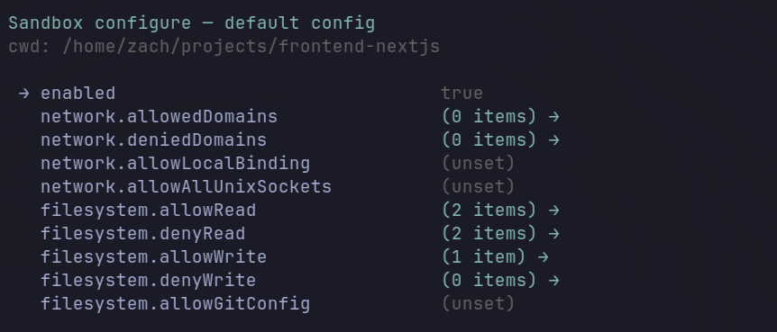

# @oddsjam/pi-sandbox

OS-level sandboxing for [pi](https://pi.dev/), built on top of [`@anthropic-ai/sandbox-runtime`](https://www.npmjs.com/package/@anthropic-ai/sandbox-runtime).



Heavily inspired by [`pi-sandbox`](https://github.com/carderne/pi-sandbox) by Chris Arderne (which is itself derived from Mario Zechner's example extension in [`badlogic/pi-mono`](https://github.com/badlogic/pi-mono)). This extension keeps the core idea — wrap pi's bash/read/write/edit tools with a permission gate backed by an OS-level sandbox — and adds in-TUI configuration, a shift+tab toggle, and a different storage layout that's friendlier to syncing `~/.pi/` across machines.

## What's different from pi-sandbox

| Feature | pi-sandbox | @oddsjam/pi-sandbox |
|---|---|---|
| Sandbox runtime | [`@carderne/sandbox-runtime`](https://www.npmjs.com/package/@carderne/sandbox-runtime) (fork) | **[`@anthropic-ai/sandbox-runtime`](https://www.npmjs.com/package/@anthropic-ai/sandbox-runtime) (upstream, directly)** |
| Config storage | `.pi/sandbox.json` (per project) + `~/.pi/agent/sandbox.json` (global) | `~/.pi/agent/sandbox/default.json` + `~/.pi/agent/sandbox/projects.json` (single user-level dir, no per-project files) |
| Config matching | Merged global + project | Longest-prefix match, no merging — most specific wins |
| Configure in pi | None — edit JSON by hand | **`/sandbox` TUI wizard** with current-config summary, scope picker, and per-field editor |
| Toggle | `/sandbox-enable`, `/sandbox-disable` slash commands | **First option in `/sandbox`** is "Disable sandbox" / "Enable sandbox" — run `/sandbox`, hit Enter, done. No shortcut to remember, no built-in keybinding to free up. The footer shows `Sandbox: disabled` in red when off. |
| Permission prompt | 4 options: abort / session / project / global | **5 options when in a subfolder** of an existing project key: adds "Allow for this project (new config)" which copies the parent entry under the cwd key |
| Disable cleanliness | Async reset fire-and-forget; session lists keep state across re-enable; env mutations not restored | **Awaits `SandboxManager.reset()`; drains session lists; restores env vars; detaches signal handlers** — closes a class of stale-state bugs (e.g. writes to `~/.bashrc` still being blocked after disable) |
| Process-level teardown | `session_shutdown` only | Also `SIGINT`/`SIGTERM`/`SIGHUP`/`beforeExit` — OS-level sandbox is reset on hard kills too |
| URL regex | Required two-dot domains (missed `x.com`-style hosts) | Fixed: `https?://[^\s/?#:]+` |
| Tests | None published | 133 `bun:test` tests across 11 files, hermetic via tmpdir HOME |

## Why the default rules are friendlier

A few small choices that make the out-of-the-box experience a lot smoother than pi-sandbox's defaults:

- **`~/.pi` is in `allowRead`.** pi-sandbox starts with `denyRead: ["/Users", "/home"]` and `allowRead: [".", "~/.config", "~/.local", "Library"]`. This blocks reads of pi's *own* config tree on Linux, which means skills, themes, prompt templates, and other extensions that live under `~/.pi/agent/...` are invisible to the sandboxed bash. We re-allow `~/.pi` by default, so pi can pull in its own resources cleanly while still blocking everything else under `/home`/`/Users`.
- **Workspace-only by default.** `allowRead: ["."]` and `allowWrite: ["."]` mean every read and every write to the cwd is silently allowed, but anything outside it prompts. System paths (`/usr`, `/lib`, `/etc`, …) remain readable for tooling.
- **Useful side effect of `.` semantics:** because `.` is resolved against pi's current working directory at start, **where you launch pi matters**:
  - `cd ~ && pi` — the cwd is `~`, so `~/.bashrc` is inside `allowRead`/`allowWrite`. Tools can edit your shell init files freely.
  - `cd ~/projects/foo && pi` — the cwd is the project, so `~/.bashrc` is outside `allowRead`/`allowWrite`. Tools get prompted (or blocked) if they try to touch it. The agent is cleanly confined to the project tree.

  This makes the same install behave correctly for both "dotfiles tweaking" sessions (launched from home) and project work (launched from the project directory) without any per-session config flips.

## How it works

### Two layers of enforcement

pi runs unsandboxed (the agent process needs `~/.pi/...` access for sessions, config, etc.). Each *tool* gets gated in its own way:

1. **Bash subprocess** — every `bash` tool call is wrapped via `SandboxManager.wrapWithSandbox(...)` from the upstream runtime. The wrapper produces a `bwrap [args] -- bash -c "socat ... apply-seccomp bash -c <user_cmd>"` invocation that:
   - sets up a Linux user/mount/PID namespace (`bubblewrap`)
   - bind-mounts `/` read-only into the namespace, masks `denyRead` paths with `tmpfs`/`/dev/null`, re-binds `allowRead` paths back on top
   - runs `apply-seccomp` to install a syscall filter that blocks Unix-socket connections to anything that isn't an allowed proxy
   - tunnels all network through an in-process HTTP/SOCKS proxy that calls back into our `SandboxAskCallback` for domain checks
   - on macOS the same surface is implemented via `sandbox-exec` instead of bubblewrap+seccomp.
2. **Read / write / edit tools** — these run in the pi (Node.js) process, *not* a subprocess, so the OS-level sandbox can't see them. We hook `pi.on("tool_call", ...)` and apply the same policy in JS:
   - `read` always prompts unless the path matches `allowRead`
   - `write` and `edit` prompt unless the path matches `allowWrite`; `denyWrite` is a hard-block, never prompted
   - the prompt's choices write back into the config (and reinitialize the bash-side sandbox so the next subprocess sees the new rules)

### Config storage

Everything lives in `~/.pi/agent/sandbox/`:

```
~/.pi/agent/sandbox/
├── default.json    # Fallback SandboxRuntimeConfig + `enabled` flag
└── projects.json   # { "<abs-project-path>": SandboxRuntimeConfig, ... }
```

- **Project lookup** uses longest-prefix match on the canonicalized cwd (symlinks resolved). `projects.json["/work/foo"]` covers `/work/foo`, `/work/foo/sub`, `/work/foo/sub/deeper`, etc.
- **No merging.** If the project entry exists, it's used in full. Otherwise `default.json` is the fallback. A project entry has the same shape as `default.json`.
- **Schema-validated** on every save via `SandboxRuntimeConfigSchema` from `@anthropic-ai/sandbox-runtime`. Invalid configs surface inline rather than corrupting the file.

The stored shape is **exactly `SandboxRuntimeConfig`** from the upstream library, plus a single extension-local `enabled` boolean. Anything documented in the upstream README works here (parent proxies, MITM, allowMachLookup, ripgrep overrides, etc.).

### Default policy

Workspace-only, matching the pattern in the [`@anthropic-ai/sandbox-runtime` docs](https://github.com/anthropic-experimental/sandbox-runtime#readme):

```json
{
  "enabled": true,
  "network": { "allowedDomains": [], "deniedDomains": [] },
  "filesystem": {
    "denyRead":  ["/Users", "/home"],
    "allowRead": [".", "~/.pi"],
    "allowWrite": ["."],
    "denyWrite": []
  }
}
```

- `denyRead: ["/Users", "/home"]` — cross-platform (`/Users` on macOS, `/home` on Linux; the path that doesn't exist on your OS is a harmless no-op).
- `allowRead: [".", "~/.pi"]` — `.` re-allows the workspace; `~/.pi` is required because the `apply-seccomp` binary that runs *inside* bubblewrap lives at `~/.pi/agent/extensions/zackify-pi-sandbox/node_modules/@anthropic-ai/sandbox-runtime/vendor/seccomp/<arch>/apply-seccomp`. Without this re-allow, the sandbox itself can't start ("apply-seccomp: No such file or directory").
- `allowWrite: ["."]` — writes restricted to the workspace.
- `allowedDomains: []` — every domain prompts on first access.

### Permission prompt

Triggered for: network domain not in `allowedDomains`, read path not in `allowRead`, write/edit path not in `allowWrite`. denyWrite hard-blocks with no prompt.

The option set is context-aware based on whether your cwd matches an entry in `projects.json`:

```
Exact match (cwd === some project key):
  [esc]  Abort
  [s]    Allow for this session only
  [P]    Allow for this project       → projects.json["/work/foo"]
  [A]    Allow for all projects       → default.json

Parent match (cwd is inside an existing project key):
  [esc]  Abort
  [s]    Allow for this session only
  [P]    Allow for this project (parent: /work/foo)
  [N]    Allow for this project (new config: /work/foo/sub)  ← copies parent entry under the cwd key, then adds the new item
  [A]    Allow for all projects

No match (no project key covers cwd):
  [esc]  Abort
  [s]    Allow for this session only
  [P]    Allow for this project       → seeds new entry from default.json
  [A]    Allow for all projects
```

Lowercase letter → requires Enter to confirm. Uppercase letter → commits immediately. `[s]` (session) and `[esc]` (abort) don't require confirm in either case. Session allowances live in JS memory only — they're never written to disk and the agent has no way to inspect them.

### `/sandbox` — inspect, toggle, configure

One command does all three. Run `/sandbox` and you see:

1. **Current effective config summary** at the top — scope (project key or default), allowed domains, read/write paths, deny lists, in-memory session allowances.
2. **`Disable sandbox`** (or `Enable sandbox` when off) as the **first selectable option**. Hitting Enter immediately at the menu toggles. No editor opens.
3. **Scope options** below the toggle: edit project config, create new project config (when in a subfolder of an existing key), edit default config.

This replaces what used to be three separate things — a `/sandbox-disable` slash command, a `/sandbox-configure` slash command, and a shift+tab shortcut that fought for the `app.thinking.cycle` binding. Now it's just `/sandbox` → Enter to flip off, or `/sandbox` → ↓ → Enter to edit.

**You can also disable via the config** by setting `enabled: false` in `default.json` or your project entry (via `/sandbox` → ↓ to a scope → Enter → toggle the `enabled` field → `s` to save). That persists across sessions, unlike the lead-action toggle which is session-only.

Field editor controls:
- `↑↓` navigate
- `enter` toggle a bool / open a list / edit a scalar
- `s` save (validates against `SandboxRuntimeConfigSchema`; surfaces errors inline rather than writing invalid JSON)
- `?` show advanced fields (`enableWeakerNestedSandbox`, `allowPty`, `mandatoryDenySearchDepth`, …)
- `esc`/`q` quit

List editor controls: `↑↓` navigate, `a` add (input prompt), `d` delete, `esc`/`b` back.

Save validates the draft against `SandboxRuntimeConfigSchema` and surfaces validation errors inline rather than writing invalid JSON. The sandbox is reinitialized after each save so changes take effect immediately.

### Status line

The footer shows one of two states:

- **Enabled** (accent colour): `🔒 Sandbox: 3 domains, 2 write paths`
- **Disabled** (`disabled` in red): `Sandbox: disabled`

Toggling via `/sandbox` updates this immediately. Toggling off runs the full disable path (see below); toggling on calls `SandboxManager.initialize` and re-attaches process-level teardown handlers.

### Disable cleanliness (the bug fix)

pi-sandbox has a few small leaks around `/sandbox-disable`:

- `SandboxManager.reset()` was fire-and-forget from the command handler — could return before teardown actually completed.
- In-memory session allowances weren't cleared, so re-enabling in the same process started with stale state.
- The `NODE_USE_ENV_PROXY=1` env mutation wasn't reverted.
- The post-bash "Operation not permitted" scanner could still fire on output containing that substring even after disable, triggering spurious write prompts (this is the source of the "writes to `~/.bashrc` still blocked after disable" symptom).

This extension's `performDisable` (in `src/disable.ts`) does all of:

1. `await SandboxManager.reset()` (awaited, error captured into result).
2. Drain `sessionAllowedDomains`, `sessionAllowedReadPaths`, `sessionAllowedWritePaths` in place.
3. Flip both `enabled` and `initialized` flags to false (the post-bash scanner checks **both**, so this fully bypasses it).
4. Restore env vars via an `EnvTracker` that recorded the originals when they were first set.
5. Detach the `SIGINT`/`SIGTERM`/`SIGHUP`/`beforeExit` handlers we attached at init time.

Each of those steps has its own unit test.

### Teardown on hard kills

`session_shutdown` covers graceful pi exits but doesn't fire on SIGINT/SIGTERM/SIGHUP. `src/teardown.ts` attaches process-level handlers that:

- On signal: detach our own handlers (so re-raising doesn't loop), run `SandboxManager.reset()`, then re-raise the same signal so pi's own handler still runs.
- On `beforeExit`: best-effort reset.

All idempotent — multiple signals during shutdown still produce exactly one teardown.

## File layout

```
zackify-pi-sandbox/                  # folder on disk (kept unchanged for sync stability)
├── package.json                  "@oddsjam/pi-sandbox", trustedDependencies: ["@anthropic-ai/sandbox-runtime"]
├── tsconfig.json                 strict, allowImportingTsExtensions, noUncheckedIndexedAccess
├── README.md                     this file
├── index.ts                      extension entry: hooks, commands, lifecycle, shift+tab shortcut
├── src/
│   ├── paths.ts                  expandPath / canonicalizePath / matchesPattern / longestPrefixMatch
│   ├── domains.ts                URL extraction + wildcard domain matching
│   ├── output.ts                 extractBlockedWritePath (parses bash "Operation not permitted")
│   ├── config.ts                 default.json + projects.json IO, longest-prefix lookup,
│   │                             append* mutators, seedNewProjectEntry, validateConfig
│   ├── prompt.ts                 pure state machine for the permission prompt (context-aware)
│   ├── prompt-ui.ts              TUI adapter using ctx.ui.custom
│   ├── wizard.ts                 pure field/scope state for /sandbox-configure
│   ├── wizard-ui.ts              TUI adapter for the wizard
│   ├── bash-ops.ts               sandbox-wrapped child_process.spawn
│   ├── status.ts                 "🔒 Sandbox: …" / "Sandbox: disabled" renderers
│   ├── summary.ts                /sandbox summary-line builder (rendered above the scope picker)
│   ├── env.ts                    EnvTracker for safely mutating + restoring process.env
│   ├── disable.ts                performDisable orchestration (testable)
│   └── teardown.ts               attachTeardown for SIGINT/SIGTERM/SIGHUP/beforeExit
└── test/                         11 files, 133 bun:test tests, hermetic tmpdir HOME
```

## Commands and keybindings

| Trigger | Effect |
|---|---|
| `/sandbox` | All-in-one. Shows effective config summary, lets you toggle on/off (first option — Enter to fire), and lets you edit the default or project configs. |
| `--no-sandbox` CLI flag | Start the session with the sandbox disabled |

There is no keyboard shortcut for toggling. The single `/sandbox` Enter path is fast enough and avoids fighting with pi's built-in `app.thinking.cycle` (shift+tab) keybinding. To make the sandbox stay off across sessions, edit `enabled: false` in the relevant config via the same `/sandbox` wizard.

## Install

Auto-discovered when placed at `~/.pi/agent/extensions/zackify-pi-sandbox/` (the folder name on disk is unchanged; the npm-style `name` in `package.json` is `@oddsjam/pi-sandbox`). Sync `~/.pi/` to other machines and pi picks it up there too.

```bash
cd ~/.pi/agent/extensions/zackify-pi-sandbox
bun install
```

`@anthropic-ai/sandbox-runtime` is listed in `trustedDependencies` so bun doesn't block its install lifecycle.

### Prerequisites

- **Linux:** `bwrap` (bubblewrap), `socat`, `ripgrep` (`rg`) — pi's bash launch PATH must include these.
- **macOS:** `sandbox-exec` (ships with macOS), `ripgrep` (`rg`).

If `apply-seccomp: No such file or directory` appears, your `~/.pi/agent/sandbox/default.json` is missing `~/.pi` in `allowRead`. Add it via `/sandbox-configure` and save — `~/.pi` must be visible inside the sandbox because the seccomp binary lives there.

## Tests

```bash
bun test         # 133 tests across 11 files
bun run typecheck
```

Pure modules are unit-tested directly with synthetic state machines and a tmpdir HOME. TUI adapters and `SandboxManager` integration aren't exercised in `bun test` because they're stateful and platform-bound — verify those by running pi.

## Acknowledgements

- [`pi-sandbox`](https://github.com/carderne/pi-sandbox) by Chris Arderne — the design this extension is built on. Most of the policy semantics (read-prompts-everything, denyWrite-overrides-allowWrite, the 4-way prompt) come from there.
- [`badlogic/pi-mono`](https://github.com/badlogic/pi-mono) by Mario Zechner — the original example extension that pi-sandbox forked from. Used under the [MIT License](https://github.com/badlogic/pi-mono/blob/main/LICENSE).
- [`@anthropic-ai/sandbox-runtime`](https://github.com/anthropic-experimental/sandbox-runtime) — the upstream OS-level sandbox library. Used directly here without forking.
